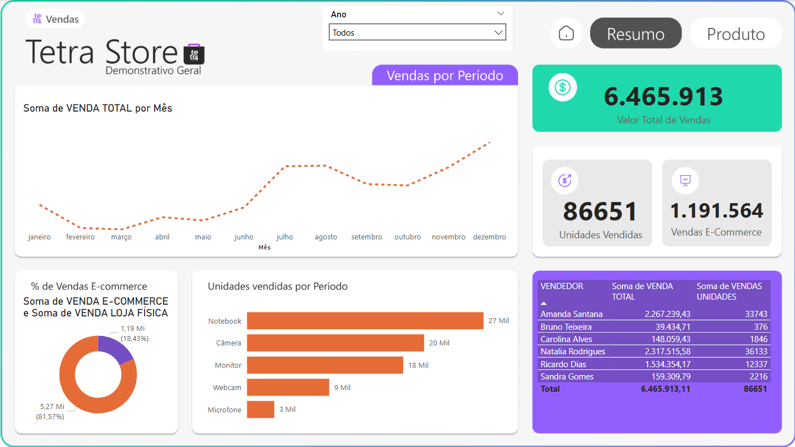
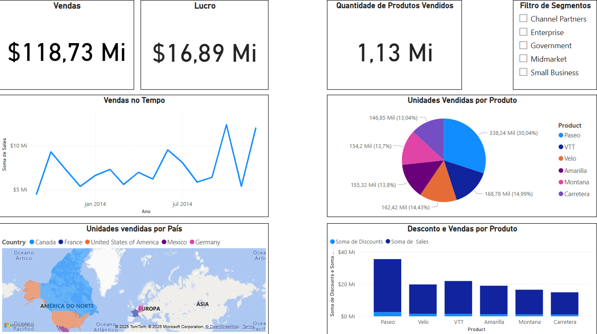

# 📊 Dashboards Power BI | Curso Analista de Dados

Este repositório contém dashboards desenvolvidos no curso de **Analista de Dados da Escola DNC**, utilizando **Power BI, SQL e Metabase**.

## 📂 Projetos Publicados  

### 🏪 Dashboard Tetra Store  
📊 **Análise de vendas e comportamento do consumidor na loja Tetra Store.**  
  

### 📈 Dashboard Desafio 01  
📊 **Exploração de dados e relatórios interativos no Power BI.**  
  

---

## 🔧 Tecnologias Utilizadas  
✔️ Power BI  
✔️ SQL  
✔️ Metabase  
✔️ Excel  

📩 **Contato:**  
📧 Email: [lucafsasso@hotmail.com](mailto:lucafsasso@hotmail.com)  
📱 WhatsApp: (11) 99560-7670  
🔗 [LinkedIn Profile](https://www.linkedin.com/in/luca-favilli-sasso/)  
